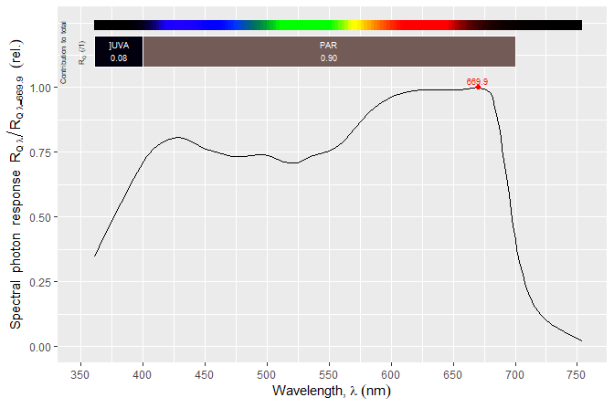

# photobiologyPlants 

<!-- badges: start -->

[](https://cran.r-project.org/package=photobiologyPlants)
[](https://cran.r-project.org/web/checks/check_results_photobiologyPlants.html)
[](https://aphalo.r-universe.dev/photobiologyPlants)
[](https://github.com/aphalo/photobiologyPlants/actions)
[](https://docs.r4photobiology.info/photobiologyPlants/)
[](https://doi.org/10.32614/CRAN.package.photobiologyPlants)
<!-- badges: end -->

Package ‘**photobiologyPlants**’ provides pre-defined functions for
quantifying visible (‘VIS’), near infra-red (‘NIR’) and ultraviolet
(‘UV’) radiation in relation to their effects on plants together with
action spectra for photosynthesis. Absorbance spectra for the plant
photoreceptors in families ‘phytochromes’, ‘cryptochromes’, ‘zeitlupe
proteins’, ‘phototropins’ and ‘UVR8s’ are included together with
absorbance spectra for plants’ “mass pigments”, including chlorophylls,
carotenoids and some other metabolites such as flavonoids.

The package also includes data sets on the optical properties of plant
organs, including whole-leaf reflectance, absorptance, transmittance and
fluorescence spectra.

All data are derived from the scientific literature. Please, see the
help pages for the different data sets for details about the primary
sources of the data.

The package includes functions for the calculation of reference
evapotranspiration using different approaches, for unit conversions for
water in the atmosphere and for the computation of the energy balance of
vegetation. These functions were included in package ‘photobiology’ (\<
0.12.0) and have been migrated to ‘photobiologyPlants’ (\>= 0.6.0).

The data in this package are stored in objects of classes defined in
package ‘**photobiology**’ which are mostly backwards compatible with
data frames but include metadata as attributes.

This package is part of a suite of R packages for photobiological
calculations described at the
[r4photobiology](https://www.r4photobiology.info) web site.

## Examples

``` r
library(photobiologyPlants)
eval_plots <- requireNamespace("ggspectra", quietly = TRUE)
if (eval_plots) library(ggspectra)
```

Spectral data are stored in R objects of classes defined in package
‘photobiology’.

``` r
class(McCree_photosynthesis.mspct$oats)
#> [1] "response_spct" "generic_spct"  "tbl_df"        "tbl"          
#> [5] "data.frame"
```

Objects contain metadata that can be queried. The `comment` attribute
commonly used in R.

``` r
comment(McCree_photosynthesis.mspct$oats)
#> [1] "One of the 'classical' action spectra of photosynthesis from K. J. McCree (1972): Avena sativa L. var. Coronado leaf sections."
```

And also other attributes defined in package ‘photobiology’.

``` r
what_measured(McCree_photosynthesis.mspct$oats)
#> [1] "Action spectrum of net CO2 uptake in Avena sativa L. var. Coronado (McCree 1972)."
how_measured(McCree_photosynthesis.mspct$oats)
#> [1] "Net CO2 uptake measured on detached leaf sections after about 2 to 10 minutes equilibration time at each wavelength"
is_normalised(McCree_photosynthesis.mspct$oats)
#> [1] TRUE
```

Functions defined in package ‘ggspectra’ make plotting easy. For
example, to plot the action spectrum of photosynthesis in Oats we can
use.

``` r
autoplot(McCree_photosynthesis.mspct$oats, unit.out = "photon")
```

<!-- -->

We can calculate the R:FR photon ratio of a light-source or iradiance
spectrum, in this case the solar spectrum at ground level measured on at
a specific location and time, included in package ‘photobiology’.

``` r
R_FR(sun.spct)
#> R:FR[q:q] 
#>  1.266704 
#> attr(,"radiation.unit")
#> [1] "q:q ratio"
```

We can also estimate the photo-equilibrium of phytochrome exposed *in
vitro* to the same spectrum.

``` r
Pfr_Ptot(sun.spct)
#> [1] 0.68341
```

## Installation

Installation of the most recent released version from CRAN (source and
binaries available):

``` r
install.packages("photobiologyLamps")
```

Installation of the current unstable version from R-Universe CRAN-like
repository (source and binaries available):

``` r
install.packages('photobiologySun', 
                 repos = c('https://aphalo.r-universe.dev', 
                           'https://cloud.r-project.org'))
```

Installation of the current unstable version from GitHub (only source
available):

``` r
# install.packages("remotes")
remotes::install_github("aphalo/photobiologylamps")
```

## Documentation

HTML documentation is available at
(<https://docs.r4photobiology.info/photobiologyPlants/>), including the
*User Guide*.

News on updates to the different packages of the ‘r4photobiology’ suite
are regularly posted at (<https://www.r4photobiology.info/>).

Two articles introduce the basic ideas behind the design of the suite
and describe its use: Aphalo P. J. (2015)
(<https://doi.org/10.19232/uv4pb.2015.1.14>) and Aphalo P. J. (2016)
(<https://doi.org/10.19232/uv4pb.2016.1.15>).

A book is under preparation, and the draft is currently available at
(<https://leanpub.com/r4photobiology/>).

A handbook written before the suite was developed contains useful
information on the quantification and manipulation of ultraviolet and
visible radiation: Aphalo, P. J., Albert, A., Björn, L. O., McLeod, A.
R., Robson, T. M., & Rosenqvist, E. (Eds.) (2012) Beyond the Visible: A
handbook of best practice in plant UV photobiology (1st ed., p. xxx +
174). Helsinki: University of Helsinki, Department of Biosciences,
Division of Plant Biology. ISBN 978-952-10-8363-1 (PDF),
978-952-10-8362-4 (paperback). PDF file available from
(<https://hdl.handle.net/10138/37558>).

## Contributing

Pull requests, bug reports, and feature requests are welcome at
(<https://github.com/aphalo/photobiologyPlants>).

## Citation

If you use this package to produce scientific or commercial
publications, please cite according to:

``` r
citation("photobiologyPlants")
#> To cite package ‘photobiologyPlants’ in publications use:
#> 
#>   Aphalo, Pedro J. (2015) The r4photobiology suite. UV4Plants Bulletin,
#>   2015:1, 21-29. DOI:10.19232/uv4pb.2015.1.14
#> 
#> A BibTeX entry for LaTeX users is
#> 
#>   @Article{,
#>     author = {Pedro J. Aphalo},
#>     title = {The r4photobiology suite},
#>     journal = {UV4Plants Bulletin},
#>     volume = {2015},
#>     number = {1},
#>     pages = {21-29},
#>     year = {2015},
#>     doi = {10.19232/uv4pb.2015.1.14},
#>   }
```

## License

© 2015-2025 Pedro J. Aphalo (<pedro.aphalo@helsinki.fi>). Released under
the GPL, version 2 or greater. This software carries no warranty of any
kind.
